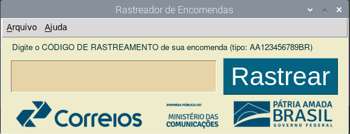

# Rastreador de Encomendas
 

Olá é com muita satisfação que apresento esta versão para o rastreador de encomendas dos Correios, uma empresa que amo de paixão (aliás, trabalho nela a mais de 14 anos).

Este software usa a Biblioteca [PySimpleGui](https://github.com/PySimpleGUI) para exibição gráfica e a Api de Rastreio do [Chipytux](https://github.com/chipytux) que funciona por requests...

## Como Instalar Rastreador de Encomendas

Clone este repositório:
 
~~~python

git clone https://github.com/elizeubarbosaabreu/Rastreamento-de-Encomendas

~~~

Navegue até o diretório com o comando:
 
~~~python

cd Rastreamento-de-Encomendas/

~~~

Crie uma máquina virtual. No windows use *python -m venv .venv* . Em outros Sistemas operacionais:
 
~~~python

python3 -m venv .venv

~~~

Ative a máquina virtual. No windows o comando *source .venv\Script\activate.bat*. No LInux e no Mac :
 
~~~python

source .venv/bin/activate

~~~

Note que apareceu um (.venv) antes do nome do usuário no terminal. Agora instale as bibliotecas e dependências:
 
~~~python

pip install -r requirements.txt

~~~

Agora teste com o comando:
 
~~~python

python app.py

~~~

## Transforme o arquivo app.py em executável

Agora para transformar o Software em executável, rode os comandos abaixo:
 
~~~python

pyinstaller app.py

~~~

Renomeie a pasta **APP** que estará dentro da pasta **dist** e mova-a para o disco D: ou outro.  
Crie um atalho para o menu (varia muito entre os diferentes sistemas operacionais)

## Raspberry Pi e Derivados do Debian

No Raspberry Pi, após transformar o app.py em executável com o passo acima, eu movo para a pasta */opt* com o comando abaixo:

~~~python

sudo mv dist/app /opt/RastreadorDeEncomendas

~~~

Agora uso o **Alacarte** ou outro **editor de menu** e crie um novo menu apontando para:
 
~~~python

/opt/RastreadorDeEncomendas/app

~~~
